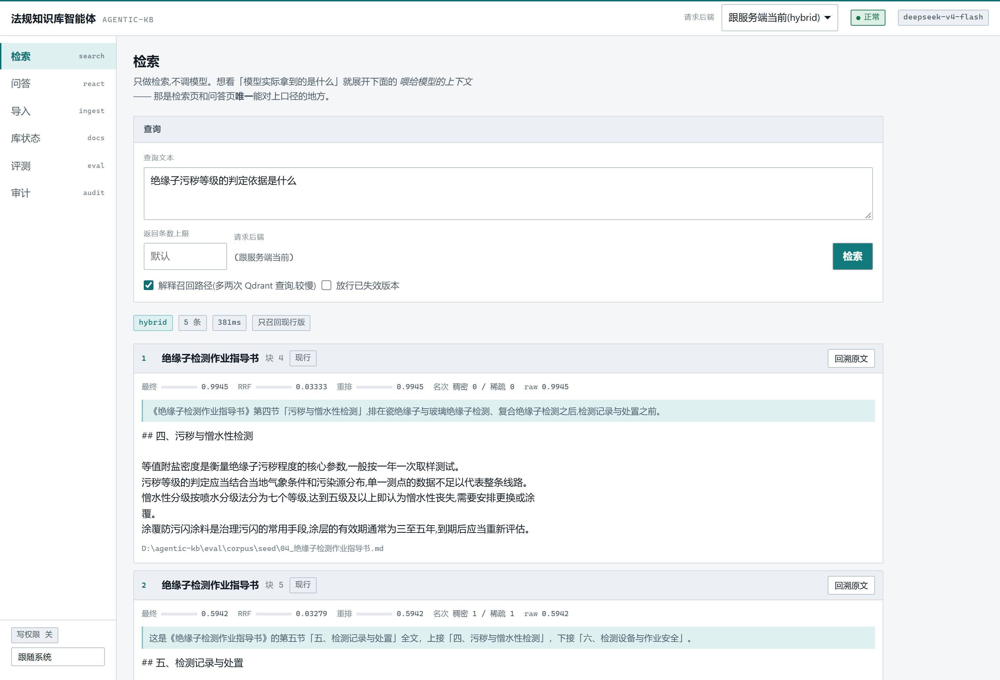
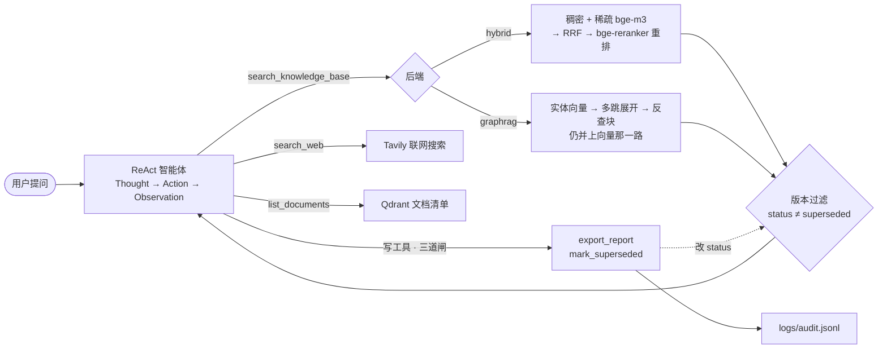

# agentic-kb

**面向中文规程文档的本地知识库智能体** —— 混合检索(稠密 + 稀疏 + RRF + 重排)、
GraphRAG、以及一个**答案可溯源到原文块**的 ReAct 智能体。规程换版时旧版本自动失效,
写完操作全程留审计日志。**全本地部署,检索侧不依赖任何外部 API。**




每条结果都摊开自己的分数:RRF 分、重排分、以及**稠密和稀疏两路各自的名次** ——
这样"这条是谁捞上来的、重排有没有改它的位置"一眼可辨,不用猜。
上面那条绿色引用块是入库时生成的**定位语**(悬停有说明),告诉你这块在全文的哪个位置。
「现行」是版本状态,`回溯原文` 能点回原文件。

## 目录

- [这是什么](#这是什么)
- [实测数据](#实测数据)
- [主要特性](#主要特性)
- [快速开始](#快速开始)
- [架构](#架构)
- [命令速查](#命令速查)
- [文档](#文档)
- [环境要求](#环境要求)
- [许可证](#许可证)

## 这是什么

电力规程这类文档有三个麻烦:**条款要能溯源**(答错就是安全事故)、
**换版频繁**(废止条款以后还要能查)、**代词密集**(「该系统」「上述参数」,
单看一块判断不出在说什么)。

这个项目把这三件事当成一等需求来做:检索结果带引用能点回原文块;
版本化索引让旧版默认不再召回、需要时可显式翻出来;
上下文定位语在入库时给每个块补一句「它在原文的什么位置、讲的是哪件事」。
检索侧(bge-m3 + bge-reranker-v2-m3)全部本地推理,只有问答和联网搜索走外部 API。

## 实测数据

自建评测集上关掉/打开重排的差值(其余配置完全相同,`@1`):

| 指标 | 重排关 | 重排开 |
|---|---|---|
| hit@1 | 0.867 | **1.000** |
| MRR@1 | 0.867 | **1.000** |
| nDCG@1 | 0.790 | **0.962** |
| recall@1 | 0.678 | **0.811** |
| 其中 `contextual` 类题 | 0.500 | **1.000** |

单独看上下文定位语的增益(重排关,只变这一个变量):hit@1 **0.800 → 0.867**。
最后两行是同一件事的两个侧面 —— 代词密集的段落靠定位语补全语义、靠重排救回来。

> **口径**:9 篇电力规程 / 61 个块,15 道可答题 + 5 道反例,
> 阈值中性档(`rerank_min_score=0`、`rerank_min_keep=0`,否则测的是阈值不是排序器),
> 按题宏平均。**这是自建的小评测集,不是公开 benchmark** —— 15 道的规模下
> 单题涨跌就能让聚合值动 0.067,所以每个数字都带 `n`。
>
> 评测脚本在 `eval/`(不调 LLM、不花钱),`scripts\eval_run.py --help` 可复现;
> 基线与逐题 diff 见 [`eval/baselines/`](eval/baselines)。
> 完整的四条评测规矩(为什么反例要独立成族、为什么跨套 diff 会被拒绝)
> 见 [docs/evaluation.md](docs/evaluation.md)。

## 主要特性

- **混合检索 + 重排**:bge-m3 **一次前向**同时出稠密和稀疏两路向量,服务端 RRF 融合,
  再由 bge-reranker-v2-m3 重排。上表就是这套组合的实测收益。
- **上下文定位语(Contextual Retrieval)**:入库时每块一次 LLM 调用,把「这块在
  原文的位置和主题」拼进被嵌入的文本。写入侧提升召回,读取侧喂给模型帮它判断该不该信。
- **GraphRAG 双后端**:实体向量 → 多跳展开 → 反查块,与向量那一路合并。
  与 hybrid **共用同一套分块和向量**,切换不用重新入库(图那一路除外)。
- **版本化索引**:`status` / `doc_version` / `effective_from` 落在 payload 上,
  旧版默认不召回,`INCLUDE_SUPERSEDED=1` 或界面勾选框可翻出废止条款。
  加字段前入库的老数据按 `current` 处理,不报错也不漏。
- **可溯源的问答**:ReAct 智能体自己决定查库 / 联网 / 列文档,答案里的
  `[文档名 (块 3)]` 在前端可点开看原文块。
- **受控写工具**:`export_report` / `mark_superseded` 带**三道闸**(白名单 → 显式确认
  → 参数校验),默认全关;每次调用向 `logs/audit.jsonl` 追加 intent/result/denied 三条记录。
- **两套界面**:Gradio(调试)与 React + FastAPI(日常),能力逐控件对齐,
  对照表在 [`api/CONTRACT.md`](api/CONTRACT.md) 附录。

## 快速开始

```bat
REM ① 起服务(两个窗口别关;Neo4j 只有 graphrag 后端需要)
scripts\start_qdrant.bat
scripts\start_neo4j.bat

REM ② 体检 —— 看到 ✅ 全部就绪 或 ⚠️ 后端可用,但 LLM 未配置 都正常
kb.bat health

REM ③ 导入你自己的文档(支持 .txt .md .pdf .docx)
kb.bat ingest D:\你的文档目录

REM ④ 不花钱就能验证检索质量
kb.bat search "你确定文档里有的短语"
kb.bat docs
```

到这里知识库已经能用了。**问答**要在 `.env` 里填 `LLM_API_KEY`
(DeepSeek / Qwen / Kimi 任何 OpenAI 兼容端点都可以),然后:

```bat
kb.bat ask "绝缘子出现裂纹怎么办" -v
```

不想记命令就 `webui.bat`,浏览器里点。完整流程与排错见
[docs/usage.md](docs/usage.md)。

## 架构



两条召回路径**共用同一套分块**(`ingest/pipeline.py` 的 `prepare_document`),
所以切后端不会换掉块。版本过滤同时挂在那两条上 —— 而 `mark_superseded` 改的
`status` 字段,正是那道过滤读的那个字段。

设计取舍(为什么图的写入不用 LlamaIndex、ReAct 为什么走文本协议而不是
function calling、为什么并发被限成 1)见 [docs/architecture.md](docs/architecture.md)。

## 命令速查

`kb.bat` 在项目根,**任何目录下都能直接调用**。

| 命令 | 干什么 | 要 LLM key? |
|---|---|---|
| `kb.bat health` | 体检:配置 + Qdrant/Neo4j 通不通 | 否 |
| `kb.bat ingest <路径>` | 导入文件或目录(内容没变会自动跳过) | 否¹ |
| `kb.bat search <查询词>` | 只检索,看召回效果 | 否 |
| `kb.bat ask <问题>` | ReAct 智能问答 | **是** |
| `kb.bat docs` / `stats` | 列出文档 / 各项计数 | 否 |

¹ 没 key 也能导入,只是每个块缺「定位语」,召回质量下降;填上 key 后重导即可补齐。

全局开关 `--backend {hybrid,graphrag}` 和 `-v` 放在子命令**前后都行**。
其余命令、参数与退出码见 [docs/usage.md](docs/usage.md#3-命令)。

## 文档

| | |
|---|---|
| [docs/usage.md](docs/usage.md) | 起服务、全部命令、`.env` 配置、从零到能问答、排错表 |
| [docs/architecture.md](docs/architecture.md) | 设计取舍、目录结构、环境与依赖 |
| [docs/evaluation.md](docs/evaluation.md) | 评测设施、指标口径、那四条规矩 |
| [docs/gotchas.md](docs/gotchas.md) | **踩过的坑**。改动前先读,失败方式几乎都是"不报错" |
| [frontend/README.md](frontend/README.md) | React 层:端口、串行队列、引用回溯 |
| [api/CONTRACT.md](api/CONTRACT.md) | HTTP 接口契约 + 两套界面的能力对照表 |

## 环境要求

- **Python 3.10**(本项目用 anaconda `py310`;`kb.bat` 里写死了路径,可用 `KB_PYTHON` 覆盖)
- **Qdrant**(端口 6343/6344)必须;**Neo4j**(7474/7687)只有 graphrag 后端需要
- **显存**:bge-m3 约 2.3G,bge-reranker-v2-m3 约 2.3G。CUDA 可用时走 GPU
  (实测 RTX 5080),没有也能跑,只是慢
- **首次运行**需要联网下模型;下完设 `KB_HF_ONLINE=0` 即可完全离线。
  换机器时设 `KB_HF_ONLINE=1` 跑一次导入
- 用到的两个模型(bge-m3 / bge-reranker-v2-m3)以及 torch 版本注意事项见
  [docs/architecture.md §7](docs/architecture.md#7-环境)

## 许可证

[MIT](LICENSE) —— 随便用,商用也行,保留版权声明即可。

> `eval/corpus/` 下那 9 篇规程是**为评测自造的样例文本**,不是正式发布的标准原文
> (无标准号、无发布机关)—— 它们只是让评测有个能跑的语料。
